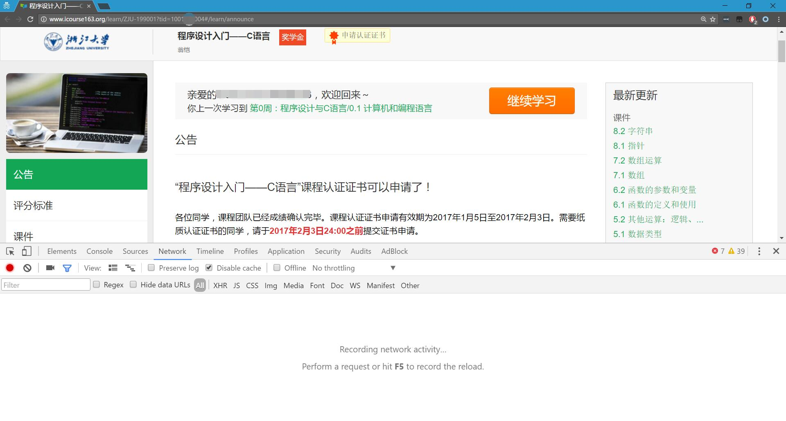
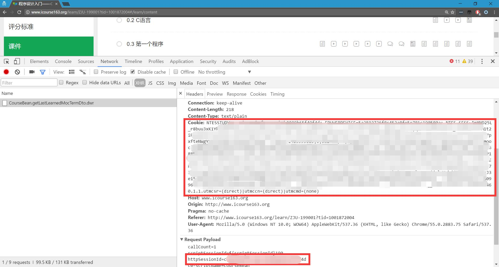

# icourse163-dl
Script for downloading download MOOCs in icourse163.org.

This script is not like [coursera-dl](https://github.com/coursera-dl/coursera-dl) or [youtube-dl](https://github.com/rg3/youtube-dl) at this time.
And This script is still a Semi-finished products.
## INSTALLATION

### 1)Prepare Python3 and model request
Windows users:
* Download Python3 from it's website:[Python3](https://www.python.org/download/releases/3.0/),and install it into PATH.
* Install [Request](http://docs.python-requests.org/zh_CN/latest/user/install.html#install) model:
```
pip install request
```
If you can't connect to pypi,Use this command:
```
python -m pip install -i https://pypi.tuna.tsinghua.edu.cn/simple requests
```
Other users:
Update or install Python3 and model.

* Also don't forget download this packet......

### 2)Get key information from website and fill those to "icourse163-dl.py"
* Open [中国大学MOOC](http://www.icourse163.org/home.htm),and login in with 163-email,NOT OAUTH.
* Click in the course you want to download.and Open The 'Developer Tools'(In chrome,F12),turn to Network panel.Open Filter and choose "XHR".
For example，

* Then turn to content menu.You will find a file named "CourseBean.getLastLearnedMocTermDto.dwr" luckly (though other dwr is OK). In it's Header,We will find the information:Cookies and Session.We need that!!

* Open the file "icourse163-dl.py",and fill in the forms at Config part.
```
# Warning:Before start ,You should fill in these forms.
# Session
httpSessionId = ''
# cookies
raw_cookies = ''
# Course url (with key "tid")
url = ''
```
* Remember a "Session-Cookies" pair can be used a serveral time(maybe 1-2 days) until the service reply "message:not_auth",so you could get another course only to change course url.

### 3)Run this script
* just run it and you will get some file.
```
dllink.txt : the video download link
docsdllink.txt : the document download link,You should download those as soon as possible 
ren.bat : Rename script for downloaded video.Before use,edit it so make videoes easier to organize
```
* Use Download tools (,for example IDM...) to download.
* Use "ren.bat" to rename the video.
* Sort those videos and documents logically
